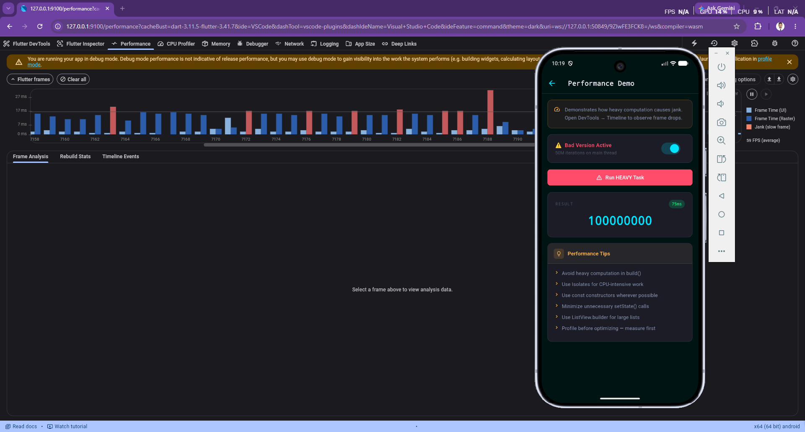
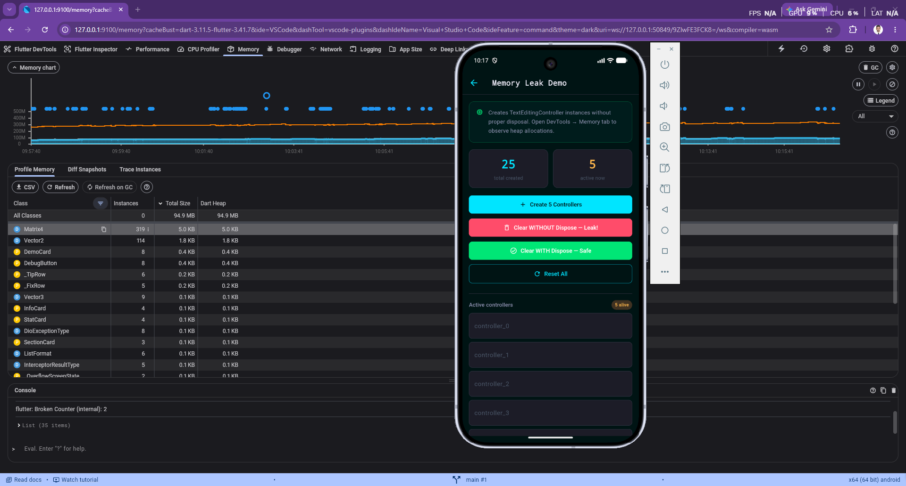
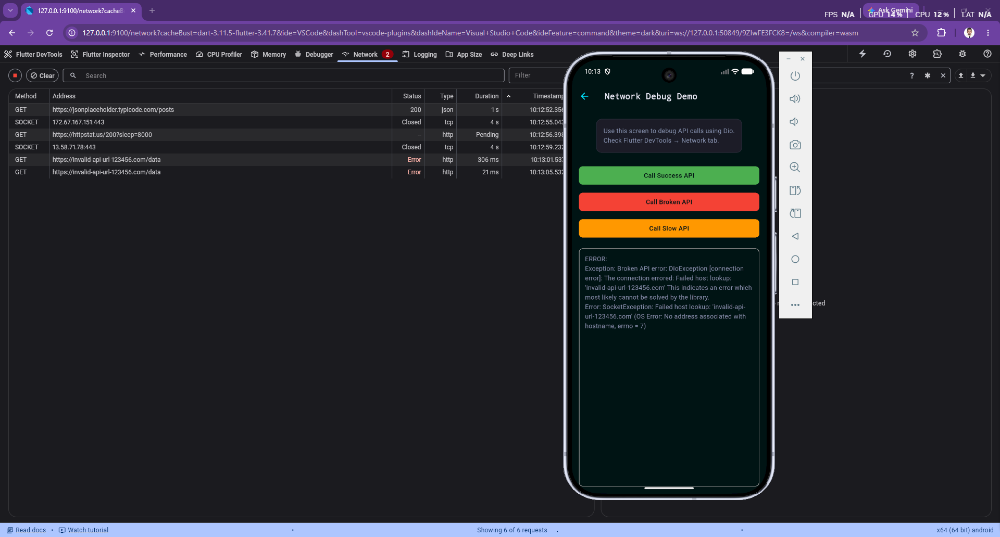
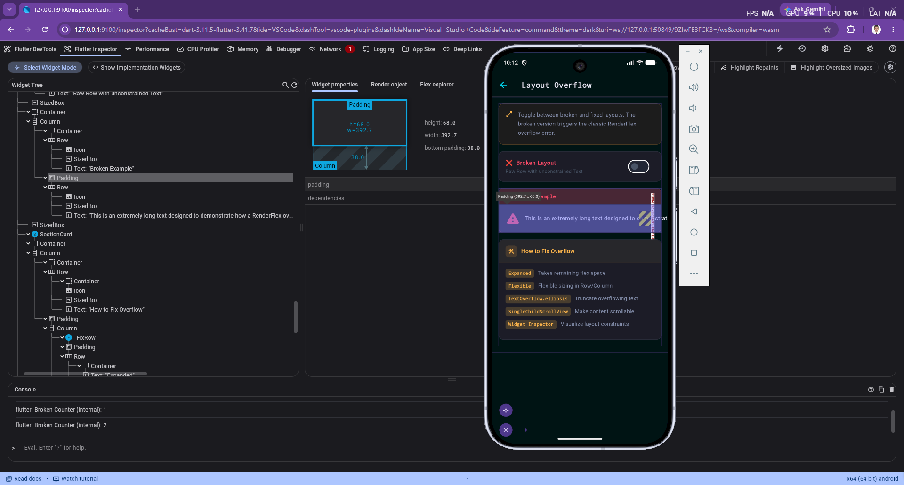
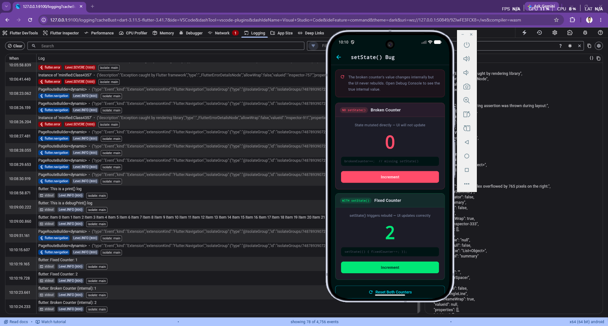
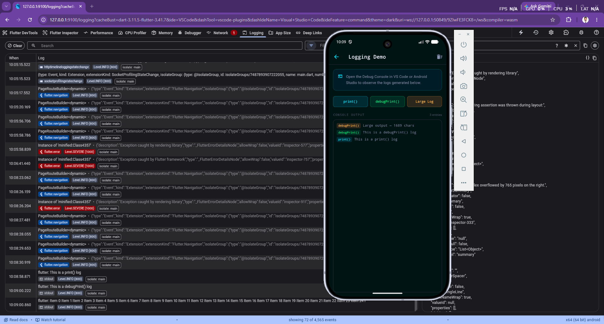

# 🐛 Flutter Debug Lab

An interactive Flutter application demonstrating real-world debugging techniques using **Flutter DevTools**. Each module intentionally introduces a specific bug or performance issue and walks you through diagnosing and fixing it with the appropriate DevTools panel.

---

## 📱 Screenshots

| Performance Demo | Memory Leak Demo |
|:---:|:---:|
|  |  |

| Network Debug | Layout Overflow |
|:---:|:---:|
|  |  |

| setState() Bug | Logging Demo |
|:---:|:---:|
|  |  |

---

## 🚀 Getting Started

### Prerequisites

- Flutter SDK `^3.41.7`
- Dart SDK `^3.11.5`
- Android Studio / VS Code with Flutter extension
- A connected device or emulator

### Installation

```bash
git clone https://github.com/your-username/debugging_and_devtools.git
cd debugging_and_devtools
flutter pub get
flutter run
```

### Opening Flutter DevTools

```bash
# DevTools URL is printed automatically after flutter run:
# An Observatory debugger and profiler on Android is available at:
# http://127.0.0.1:9100/...

# Or open from VS Code:
# Command Palette → "Flutter: Open DevTools in Web Browser"
```

---

## 📦 Dependencies

| Package | Version | Purpose |
|---|---|---|
| `dio` | `^5.9.0` | HTTP networking client with timeout and error handling |
| `firebase_core` | `^4.1.1` | Firebase SDK initialization |
| `firebase_crashlytics` | `^5.0.2` | Production crash reporting |
| `cupertino_icons` | `^1.0.8` | iOS-style icon set |
| `flutter_lints` | `^6.0.0` | Code quality lint rules (dev) |

---

## 🧩 Modules

### 1. 📋 Logging Demo
**DevTools Tab:** Logging

Demonstrates the difference between `print()` and `debugPrint()`.

- `print()` — unthrottled, may truncate on Android logcat for large output
- `debugPrint()` — rate-limited, safe for large payloads, preferred for debug logging
- Large Log button — generates a 1,689-character string to show chunked output

```dart
// ✅ Preferred for debug logging
debugPrint('This is a debugPrint() log');

// ⚠️  May truncate on Android for large strings
print('This is a print() log');
```

---

### 2. 🔄 setState() Bug
**DevTools Tab:** Logging

Side-by-side comparison of a broken and a fixed counter widget.

```dart
// ❌ BROKEN — state changes internally, UI never rebuilds
void incrementBrokenCounter() {
  brokenCounter++; // Missing setState()!
}

// ✅ FIXED — setState() schedules a widget rebuild
void incrementFixedCounter() {
  setState(() {
    fixedCounter++;
  });
}
```

**How to spot it:** The Logging tab shows the internal value incrementing while the on-screen counter stays at 0.

---

### 3. 📐 Layout Overflow
**DevTools Tab:** Flutter Inspector

Triggers the classic `RenderFlex overflowed by N pixels` error and demonstrates five ways to fix it.

```dart
// ❌ BROKEN — unconstrained Text in a Row
Row(children: [
  Icon(Icons.warning_rounded),
  Text(longText), // No width constraint!
]);

// ✅ FIXED — Expanded wraps Text with bounded constraints
Row(children: [
  Icon(Icons.check_circle_rounded),
  Expanded(
    child: Text(longText, overflow: TextOverflow.ellipsis, maxLines: 3),
  ),
]);
```

| Fix | When to Use |
|---|---|
| `Expanded` | Child should fill all remaining space |
| `Flexible` | Child should size naturally but not overflow |
| `TextOverflow.ellipsis` | Truncate text with `...` |
| `SingleChildScrollView` | Make content scrollable instead of clipping |
| **Widget Inspector** | Visualize constraints to find the overflowing widget |

---

### 4. 🌐 Network Debug Demo
**DevTools Tab:** Network

Uses Dio to demonstrate three categories of network failures.

| Button | Endpoint | Expected Result |
|---|---|---|
| Call Success API | `jsonplaceholder.typicode.com/posts` | HTTP 200, JSON array |
| Call Broken API | `invalid-api-url-123456.com/data` | `DioException` — DNS failure (errno 7) |
| Call Slow API | `httpstat.us/200?sleep=8000` | Timeout after 5s `receiveTimeout` |

```dart
final Dio _dio = Dio(
  BaseOptions(
    connectTimeout: const Duration(seconds: 5),
    receiveTimeout: const Duration(seconds: 5),
  ),
);
```

**DioException types to know:** `connectionError`, `receiveTimeout`, `connectionTimeout`, `badResponse`, `cancel`

---

### 5. 💾 Memory Leak Demo
**DevTools Tab:** Memory

Creates `TextEditingController` instances and compares clearing them with and without `dispose()`.

```dart
// ❌ LEAK — native resources not released
void clearWithoutDispose() {
  controllers.clear();
}

// ✅ SAFE — dispose() releases native listener bindings
void clearWithDispose() {
  for (var controller in controllers) {
    controller.dispose();
  }
  controllers.clear();
}

// ✅ Always clean up in dispose()
@override
void dispose() {
  for (var controller in controllers) {
    controller.dispose();
  }
  super.dispose();
}
```

**DevTools workflow:** Profile Memory → create controllers → clear without dispose → Diff Snapshots → observe survivors → clear with dispose → Refresh on GC → heap drops.

---

### 6. ⚡ Performance Demo
**DevTools Tab:** Performance

Compares a 50M-iteration main-thread computation (causes jank) against a 1M-iteration version (smooth).

```dart
// ❌ BAD — blocks the UI thread for ~75ms, causes dropped frames
int heavyCalculation() {
  int result = 0;
  for (int i = 0; i < 50000000; i++) { // 50 million
    result += (i % 5);
  }
  return result;
}

// ✅ OPTIMIZED — 50x less work, UI stays smooth
void runOptimizedTask() {
  int result = 0;
  for (int i = 0; i < 1000000; i++) { // 1 million
    result += (i % 5);
  }
  setState(() { heavyResult = result; });
}
```

**Performance tips:**
- Avoid heavy computation in `build()`
- Use `Isolate` / `compute()` for CPU-intensive work
- Use `const` constructors to skip unnecessary rebuilds
- Use `ListView.builder` instead of `ListView` for long lists
- Profile with `flutter run --profile` for accurate measurements

---

## 🛠️ Flutter DevTools Reference

| Panel | Best For |
|---|---|
| **Flutter Inspector** | Widget tree exploration, layout constraints, RenderFlex issues |
| **Performance** | Jank detection, frame timeline, rebuild stats |
| **CPU Profiler** | Flame graphs, method-level CPU cost |
| **Memory** | Heap snapshots, leak detection, instance tracking |
| **Network** | HTTP request inspection, status codes, durations |
| **Logging** | Structured log viewer with level and isolate filtering |
| **App Size** | APK/IPA size breakdown by library and asset |

### Bug → DevTools Quick Map

| Bug Type | Open This Tab | Signal to Look For |
|---|---|---|
| UI not updating | Logging | State increments in logs but widget shows 0 |
| Layout overflow | Inspector | Yellow stripe overlay, overflow pixels in render object |
| Performance jank | Performance | Frame bars above 16ms line, red jank indicators |
| Memory leak | Memory | Heap grows over time; instances survive GC |
| Network failure | Network | Error status, DioException in response body |
| Log truncation | Logging | Switch `print()` → `debugPrint()` |

---

## 🔥 Error Handling

### Async try-catch-finally pattern

```dart
Future<void> callApi(Future<dynamic> Function() apiCall) async {
  setState(() { isLoading = true; });
  try {
    final response = await apiCall();
    setState(() { result = response.toString(); });
  } on DioException catch (e) {
    setState(() { result = 'Network Error: ${e.message}'; });
  } catch (e) {
    setState(() { result = 'Error:\n$e'; });
  } finally {
    setState(() { isLoading = false; }); // Always runs
  }
}
```

### Firebase Crashlytics setup

```dart
void main() async {
  WidgetsFlutterBinding.ensureInitialized();
  await Firebase.initializeApp();

  // Catch Flutter framework errors
  FlutterError.onError = FirebaseCrashlytics.instance.recordFlutterFatalError;

  // Catch errors outside Flutter (async gaps)
  PlatformDispatcher.instance.onError = (error, stack) {
    FirebaseCrashlytics.instance.recordError(error, stack, fatal: true);
    return true;
  };

  runApp(const DebugLabApp());
}
```

---

## 📁 Project Structure

```
lib/
├── main.dart                        # App entry point, MaterialApp, system UI overlay
├── theme/
│   └── app_theme.dart               # AppColors, AppTheme.dark design tokens
├── screens/
│   ├── home_screen.dart             # Navigation hub with 8 module cards
│   ├── logging_screen.dart          # print() vs debugPrint() demo
│   ├── counter_bug_screen.dart      # setState() missing bug demo
│   ├── overflow_screen.dart         # RenderFlex overflow demo
│   ├── network_error_screen.dart    # Dio API error demo
│   ├── memory_leak_screen.dart      # Controller disposal demo
│   ├── performance_screen.dart      # Jank detection demo
│   ├── crash_test-screen.dart       # Intentional runtime crashes
│   ├── crashlytics_screen.dart      # Firebase Crashlytics demo
│   └── devtool_screen.dart          # Complete DevTools reference guide
├── services/
│   └── api_service.dart             # Dio service: success, broken, slow endpoints
└── widgets/
    ├── demo_card.dart               # Home screen navigation card
    └── shared_widgets.dart          # InfoCard, SectionCard, DebugButton, StatCard
```

---

## 📚 Learning Objectives

- [x] Understand `print()` vs `debugPrint()` and when to use each
- [x] Identify and fix missing `setState()` causing stale UI
- [x] Diagnose and resolve `RenderFlex` overflow errors
- [x] Debug network failures using Dio and the Network tab
- [x] Detect memory leaks caused by undisposed controllers
- [x] Identify UI jank using the Performance timeline
- [x] Use the Widget Inspector to inspect layout constraints
- [x] Use Memory Profiler for heap snapshots and diff analysis
- [x] Handle `DioException` types with proper try-catch patterns
- [x] Set up Firebase Crashlytics for production crash reporting

---

## 📝 License

This project is created for educational purposes as part of the Linkific Daily Tasks Flutter learning program.
